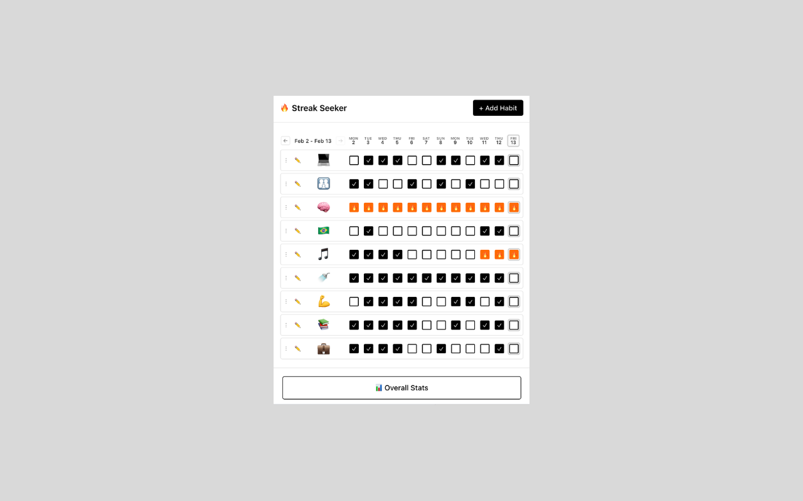

# 🔥 Streak Seeker

A beautiful, privacy-first habit tracker Chrome extension. Track daily habits, build streaks, and visualize your progress—all without leaving your browser.

[](https://chromewebstore.google.com/detail/streak-seeker/jbldckdbhaibiejndigjmgdaacainphh?authuser=0&hl=en)
[]()
[]()



## ✨ Features

- **🎯 Track Unlimited Habits** - Add as many habits as you want with custom emoji icons
- **🔥 Visual Streak Tracking** - See your current streaks with fire emoji indicators
- **📊 Interactive Heatmaps** - GitHub-style contribution graphs (7/30/90/180/365 days)
- **📈 Detailed Stats** - Completion rates, perfect days, longest streaks
- **↕️ Drag & Drop** - Reorder habits with smooth animations
- **🕰️ Time Travel** - Navigate through past dates to view historical data
- **🔒 100% Private** - All data stored locally using browser localStorage
- **🚫 No Login Required** - Start tracking immediately
- **⚡ Lightweight** - Fast and responsive

## 🚀 Installation

### From Chrome Web Store (Recommended)
1. Visit the [Chrome Web Store](https://chromewebstore.google.com/detail/streak-seeker/jbldckdbhaibiejndigjmgdaacainphh?authuser=0&hl=en)
2. Click "Add to Chrome"
3. Click the extension icon to start tracking!

### From Source
1. Clone the repository
```bash
   git clone https://github.com/YOUR-USERNAME/streak-seeker.git
   cd streak-seeker
```

2. Install dependencies
```bash
   npm install
```

3. Build the extension
```bash
   npm run build
```

4. Load in Chrome
   - Open `chrome://extensions/`
   - Enable "Developer mode"
   - Click "Load unpacked"
   - Select the `dist` folder

## 🛠️ Tech Stack

- **React** - UI framework
- **Vite** - Build tool and dev server
- **@dnd-kit** - Drag and drop functionality
- **localStorage** - Data persistence
- **Chrome Extension Manifest V3** - Extension platform

## 📸 Screenshots

### Main View
Track your daily habits with a clean, minimal interface.


### Overall Stats
View comprehensive statistics and heatmaps across different time periods.


### Habit Details
Deep dive into individual habit performance and trends.


## 🎯 Usage

### Adding a Habit
1. Click "+ Add Habit"
2. Enter a name (e.g., "Morning Exercise")
3. Choose an emoji icon
4. Click "Create"

### Tracking Completions
- Click any checkbox to mark a habit as complete for that day
- Fire emojis (🔥) appear automatically when you build a streak
- Today's column is highlighted for easy reference

### Viewing Stats
- Click "📊 Overall Stats" to see heatmaps and insights
- Click any habit emoji to view detailed statistics
- Use ← → buttons to navigate through different time periods

### Reordering Habits
- Click and drag the ⋮ handle to reorder habits
- Your order is saved automatically

## 🏗️ Development

### Prerequisites
- Node.js 16+
- npm or yarn

### Setup
```bash
# Install dependencies
npm install

# Start development server
npm run dev

# Build for production
npm run build

# Build and watch for changes
npm run build -- --watch
```

### Project Structure
```
streak-seeker/
├── public/
│   ├── manifest.json       # Chrome extension manifest
│   ├── icon16.png         # Extension icons
│   ├── icon48.png
│   └── icon128.png
├── src/
│   ├── components/        # React components
│   │   ├── HabitList.jsx
│   │   ├── HabitRow.jsx
│   │   ├── HabitModal.jsx
│   │   ├── HabitDetailView.jsx
│   │   └── OverallView.jsx
│   ├── utils/            # Utility functions
│   │   ├── storage.js    # localStorage operations
│   │   └── dateHelpers.js
│   ├── App.jsx           # Main app component
│   └── main.jsx          # Entry point
├── dist/                 # Build output
└── vite.config.js       # Vite configuration
```

## 🔒 Privacy

Streak Seeker is built with privacy as a core principle:

- **No data collection** - We don't collect, store, or transmit any user data
- **No analytics** - No tracking, no telemetry, no third-party services
- **No login required** - No accounts, no authentication, no servers
- **Local storage only** - All data stays on your device using browser localStorage
- **No permissions** - The extension doesn't request any special browser permissions

Your habit data is yours and yours alone.

## 🗺️ Roadmap

- [ ] Export/import data (JSON)
- [ ] Habit categories/tags
- [ ] Notes on completions
- [ ] Weekly/monthly review summaries
- [ ] Keyboard shortcuts

## 🐛 Known Issues

- Checkboxes may appear slightly misaligned on some screen sizes
- Drag and drop can be finicky on touchscreens

## 🤝 Contributing

Contributions are welcome! Please feel free to submit a Pull Request.

1. Fork the repository
2. Create your feature branch (`git checkout -b feature/AmazingFeature`)
3. Commit your changes (`git commit -m 'Add some AmazingFeature'`)
4. Push to the branch (`git push origin feature/AmazingFeature`)
5. Open a Pull Request

## 📝 License

This project is licensed under the MIT License - see the [LICENSE](LICENSE) file for details.

## 🙏 Acknowledgments

- Inspired by habit tracking apps like Habitica, Streaks, and Way of Life
- Built during [#100DaysOfCode](https://www.100daysofcode.com/)

## 📧 Contact

Your Name - [@realNeilVR](https://x.com/realNeilVR) 

---

**Built with ❤️ and ☕**

If you find this useful, consider giving it a ⭐ on GitHub!
